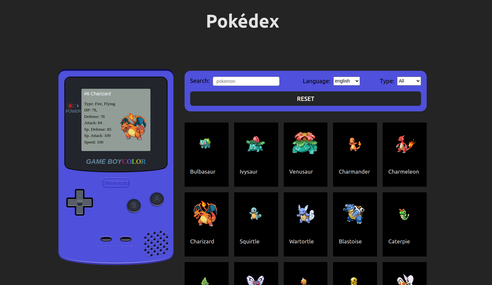

# Pokédex

Pokédex is a web application built using React and Axios that lets you search for Pokémon by name, language, and type. You can also view detailed information about each Pokémon, such as its type, moves, and stats.

## Getting Started

To get started, you'll need to install the dependencies by running the following command:

Once the dependencies are installed, you can start the development server by running:

This will launch the application in your browser at http://localhost:3070/.

## Usage

Once the application is running, you can use the following features:

- Search for Pokémon by name: Enter a Pokémon name in the search bar and press enter. The search results will be displayed on the screen.

- Filter Pokémon by language: Use the drop-down menu to select a language. The Pokémon names will be displayed in the selected language.

- Filter Pokémon by type: Use the drop-down menu to select a Pokémon type. The search results will be filtered to display only the Pokémon of the selected type.

- View detailed information about a Pokémon: Click on a Pokémon card to view its detailed information, including its type, moves, and stats.

## Contributing

If you'd like to contribute to the project, feel free to submit a pull request or create an issue.

## Credits

The Pokédex application uses the following libraries and frameworks:

- React
- Axios

